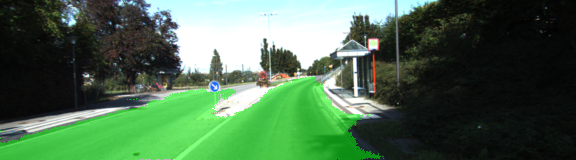
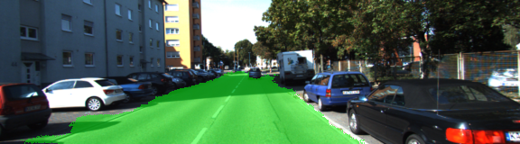
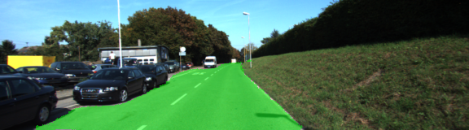
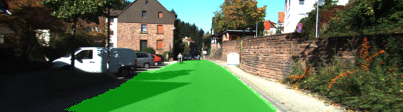
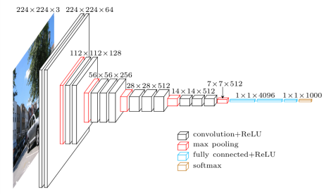
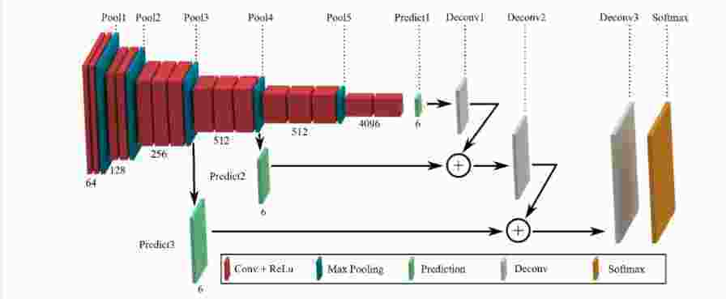

# Semantic Segmentation
### Introduction
In this project, the pixels of a road in images are labeled using a Fully Convolutional Network (FCN).


## Objective: <a name="objective"></a>

In this project, NVDIA GTX 1060 TI graphics card used for training. There are number of hyper parameters, epochs, batch sizes, learning rates, and dropouts and here are the optimal parameters are found as follow:
    -Epochs: 25
    -Batch Size: 8
    -Learning rate: 0.0001
    -Dropouts: 0.2

## Results <a name="results">

The following images of the output of the results of Fully Convolutional Network for Semantic Segmentation:









### Setup
##### Frameworks and Packages
Make sure you have the following is installed:
 - [Python 3](https://www.python.org/)
 - [TensorFlow](https://www.tensorflow.org/)
 - [NumPy](http://www.numpy.org/)
 - [SciPy](https://www.scipy.org/)

##### Dataset
Download the [Kitti Road dataset](http://www.cvlibs.net/datasets/kitti/eval_road.php) from [here](http://www.cvlibs.net/download.php?file=data_road.zip).  Extract the dataset in the `data` folder.  This will create the folder `data_road` with all the training a test images.

##### Run
Run the following command to run the project:
```
python main.py
```

### Description
For this project, pretrained VGG16 model is being used. Input image dataset is followed by multiple convolution and max pooling layers.

The spatial information is retained by deconvoluting the model. 





### Refernces
https://people.eecs.berkeley.edu/~jonlong/long_shelhamer_fcn.pdf
